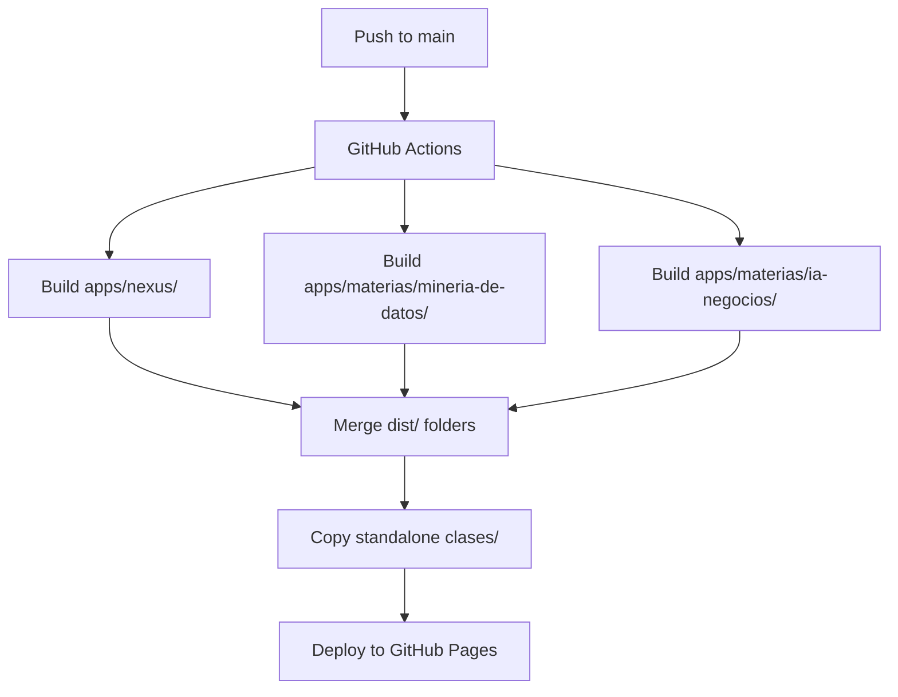

# Arquitectura Docencia - Orbital Nexus

Este repositorio implementa **Orbital Nexus**, un sistema de sitios web federados que conecta docencia, proyectos y recursos bajo el ecosistema Orbital Lab, desplegable en GitHub Pages.

## 🏗️ Arquitectura Multi-Site

```
https://<user>.github.io/externado-docencia/
│
├── /                          ← Orbital Nexus (hub principal)
│   ├── Hero cinemático con video orbital
│   ├── Grid de 5 verticales (Deportes, Negocio, Biología, Otros, Academia)
│   ├── Catálogo de materias
│   └── Showcase de proyectos (Strivio, Lighthouse, Jaguar)
│
├── /materias/
│   ├── /mineria-de-datos/     ← Site de Minería de Datos
│   ├── /ia-negocios/          ← Site de IA para Negocios
│   └── ...                     (escalable: agregar materias sin reestructurar)
│
├── /clases/                   ← Guías HTML standalone
│   ├── /2025-10-23-crisp-dm/
│   └── /2025-10-28-prep-datos/
│
└── /recursos/                 ← Datasets, templates públicos
```

### Estructura de Directorios

#### Apps (Sitios Independientes)
```
apps/
├── nexus/                     # Hub principal (base: '/')
│   ├── src/
│   │   ├── pages/
│   │   ├── layouts/
│   │   ├── components/
│   │   └── content/
│   │       ├── materias/       # Data: catálogo de materias
│   │       ├── proyectos/      # Data: showcase proyectos
│   │       └── config.ts       # Schemas Zod
│   ├── public/
│   └── astro.config.ts        # BASE_PATH: '/'
│
└── materias/
    ├── mineria-de-datos/      # Site materia (base: '/materias/mineria-de-datos')
    │   ├── src/
    │   │   ├── pages/
    │   │   └── content/
    │   │       ├── clases/     # MDX: una clase = un archivo
    │   │       └── config.ts
    │   └── astro.config.ts    # BASE_PATH: '/materias/mineria-de-datos'
    │
    └── ia-negocios/           # Site materia (base: '/materias/ia-negocios')
        └── ...
```

#### Packages (Código Compartido)
```
packages/
├── ui-components/             # Componentes Astro reutilizables
│   ├── Hero.astro
│   ├── LabGrid.astro
│   ├── GlobalNav.astro
│   └── package.json
│
└── orbital-theme/             # Tokens de diseño + Tailwind config
    ├── theme.json             # Colores, tipografía, spacing
    ├── tailwind.config.js
    └── package.json
```

#### Materias (Contenido Legacy)
```
materias/
├── mineria-de-datos/
│   ├── clases/
│   │   └── 2025-10-23-crisp-dm-fases-1-2/
│   │       ├── index.html     # Guía standalone (→ /clases/)
│   │       └── README.md
│   ├── docs/
│   └── recursos/
└── ...
```

**Nota**: Las guías HTML standalone (`materias/*/clases/*/index.html`) se copian directamente al `dist/clases/` del hub durante el build.

#### Recursos Compartidos
```
recursos_compartidos/
├── componentes/
│   └── orbital_lab/
│       ├── assets/            # Logos, videos, ilustraciones
│       └── tokens/            # theme.json, paletas
├── datasets/                  # Datasets públicos
├── plantillas/                # Templates reutilizables
└── tutoriales/                # Guías transversales
```

#### Herramientas
```
herramientas/
└── scripts/
    ├── create-materia.js      # Scaffold nueva materia
    ├── create-clase.js        # Scaffold nueva clase
    └── build-all.js           # Build orquestador
```

## 🔄 Flujo de Build y Deploy



### Build Strategy

1. **Build independiente**: Cada app se construye con su `BASE_PATH` correcto
   ```bash
   cd apps/nexus && npm run build              # → dist/ (base: '/')
   cd apps/materias/mineria-de-datos && npm run build  # → dist/ (base: '/materias/mineria-de-datos')
   ```

2. **Merge de outputs**: Script combina todos los `dist/` en estructura final
   ```bash
   final-dist/
   ├── index.html                # Nexus
   ├── materias/
   │   ├── mineria-de-datos/
   │   │   └── index.html        # Site de Minería
   │   └── ia-negocios/
   │       └── index.html        # Site de IA Negocios
   └── clases/
       ├── 2025-10-23-crisp-dm/
       │   └── index.html        # Guía standalone
       └── ...
   ```

3. **Deploy**: `final-dist/` → GitHub Pages vía Actions

## 📦 Gestión de Monorepo

### npm workspaces

```json
// package.json (root)
{
  "name": "orbital-nexus",
  "private": true,
  "workspaces": [
    "apps/*",
    "apps/materias/*",
    "packages/*"
  ],
  "scripts": {
    "build": "node herramientas/scripts/build-all.js",
    "dev:nexus": "npm run dev --workspace=apps/nexus",
    "dev:mineria": "npm run dev --workspace=apps/materias/mineria-de-datos"
  }
}
```

### Dependencias Compartidas

```json
// apps/nexus/package.json
{
  "dependencies": {
    "@orbital/ui-components": "workspace:*",
    "@orbital/theme": "workspace:*"
  }
}
```

## 🎨 Sistema de Diseño

### Tokens Globales (`packages/orbital-theme/theme.json`)

```json
{
  "colors": {
    "orbital-red": "#ED2024",
    "orbital-black": "#000000",
    "orbital-cyan": "#00D4FF"
  },
  "typography": {
    "heading": "Overcame Bold",
    "body": "Audiowide Regular"
  }
}
```

### Uso en Componentes

```astro
---
// apps/nexus/src/components/Hero.astro
import { Hero as BaseHero } from '@orbital/ui-components';
---

<BaseHero
  title="Orbital Lab"
  videoSrc="/assets/hero/orbital-motion-bg.mp4"
/>
```

## 🚀 Flujos de Trabajo

### Crear Nueva Materia (Site Completo)

```bash
# 1. Generar estructura con scaffold
npm run create:materia -- --name "nueva-materia"

# Esto crea:
# - apps/materias/nueva-materia/ (sitio Astro)
# - materias/nueva-materia/ (contenido legacy)
# - Entrada en apps/nexus/src/content/materias/nueva-materia.json

# 2. Configurar metadata
# Editar: apps/nexus/src/content/materias/nueva-materia.json
{
  "title": "Nueva Materia",
  "slug": "nueva-materia",
  "vertical": "academia",
  "descripcion": "...",
  "thumbnail": "/assets/materias/nueva-materia.jpg"
}

# 3. Desarrollar site
cd apps/materias/nueva-materia
npm run dev

# 4. Agregar al catálogo
# El hub de Nexus detectará automáticamente la nueva entrada en content/materias/
```

### Crear Nueva Clase

```bash
# 1. Opción A: Guía HTML standalone (legacy)
cd materias/nueva-materia/clases
mkdir 2025-11-15-tema
# Crear index.html, README.md, assets/

# 2. Opción B: MDX en Content Collections (nuevo)
cd apps/materias/nueva-materia/src/content/clases
# Crear: 2025-11-15-tema.mdx
```

**Ejemplo MDX**:
```mdx
---
title: "Introducción a Redes Neuronales"
date: 2025-11-15
instructor: "Julián Zuluaga"
tags: ["deep-learning", "pytorch"]
recursos:
  - notebook: "/recursos/notebooks/intro-nn.ipynb"
  - dataset: "/recursos/datasets/mnist.zip"
---

# Introducción a Redes Neuronales

<Alert type="info">
  Esta clase cubre los fundamentos de backpropagation y SGD.
</Alert>

## Contenido

...
```

### Actualizar Assets

```bash
# Logos, videos, ilustraciones
cp nuevo-asset.mp4 recursos_compartidos/componentes/orbital_lab/assets/

# Usar en apps
<video src="/assets/orbital_lab/nuevo-asset.mp4" />
```

## ✅ Buenas Prácticas

### Código
- **Reutiliza componentes de `@orbital/ui-components`** antes de crear nuevos
- **Usa tokens de `@orbital/theme`** para colores y tipografía
- **Mantén consistencia** entre todos los sites (nav, footer, estilos)

### Contenido
- **Frontmatter completo**: Siempre incluye title, date, tags, recursos
- **MDX para interactividad**: Usa componentes embebidos (Alert, CodeBlock, VideoPlayer)
- **Assets centralizados**: Datasets y recursos compartidos en `recursos_compartidos/`

### Dependencias
- **No versionar `node_modules/`**: Usar npm workspaces
- **Lock file único**: `package-lock.json` en raíz
- **Python**: `requirements.txt` por proyecto, no `venv/`

### Git
- **Commits atómicos**: Un feature = un commit
- **Mensajes descriptivos**: `feat(nexus): add LabGrid animation`
- **Branch strategy**: `main` (prod), `dev` (staging)

## 📋 Checklist de Despliegue

Antes de hacer push a `main`:

- [ ] Build local exitoso (`npm run build`)
- [ ] Todos los sites funcionan con sus `BASE_PATH`
- [ ] Assets copiados correctamente a `public/`
- [ ] Links internos usan rutas relativas correctas
- [ ] Metadata actualizada en Content Collections
- [ ] README de materia actualizado con nueva clase
- [ ] No hay secrets o credenciales en código
- [ ] Tests básicos pasan (si aplica)

## 🛠️ Roadmap de Implementación

### Fase 1: Fundamentos (Semana 1-2) ✅ ACTUAL
- [x] Documentación completa (REQUIREMENTS, STATUS, CONTRIBUTING, ARCHITECTURE)
- [x] Assets visuales generados (46 archivos)
- [x] Estructura de directorios definida
- [ ] Inicializar monorepo (package.json root + workspaces)
- [ ] Setup packages/orbital-theme con tokens

### Fase 2: Hub Nexus (Semana 3-4)
- [ ] Crear `apps/nexus/` con Astro
- [ ] Implementar Hero con video y parallax
- [ ] Implementar LabGrid (5 verticales)
- [ ] Implementar Catálogo de Materias
- [ ] Implementar Showcase de Proyectos
- [ ] Implementar Bio + Contact

### Fase 3: Site de Materia (Semana 5)
- [ ] Crear template `apps/materias/_template/`
- [ ] Migrar `mineria-de-datos/` a nuevo formato
- [ ] Content Collections para clases (MDX)
- [ ] Listado de clases con filtros
- [ ] Página individual de clase

### Fase 4: CI/CD (Semana 6)
- [ ] GitHub Actions workflow
- [ ] Script `build-all.js` con merge
- [ ] Deploy a GitHub Pages
- [ ] Testing E2E (Playwright)

### Fase 5: Optimizaciones (Semana 7-8)
- [ ] Lazy loading de videos
- [ ] Image optimization (Astro Image)
- [ ] Search (Pagefind)
- [ ] Analytics (Plausible o similar)

### Fase 6: Escalabilidad (Ongoing)
- [ ] Agregar más materias al sistema
- [ ] Mejorar generadores (scaffolds)
- [ ] Documentación para contribuidores externos
- [ ] i18n si se requiere bilingüe

---

**Documentación Relacionada**:
- 📖 [Requerimientos Completos](docs/ORBITAL_NEXUS_REQUIREMENTS.md)
- 📊 [Estado del Proyecto](docs/PROJECT_STATUS.md)
- 🤝 [Guía de Contribución](docs/CONTRIBUTING.md)
- 🎨 [Manifiesto de Marca](docs/brand/manifesto.md)

---

Este documento es la fuente de verdad técnica para la arquitectura de Orbital Nexus.
